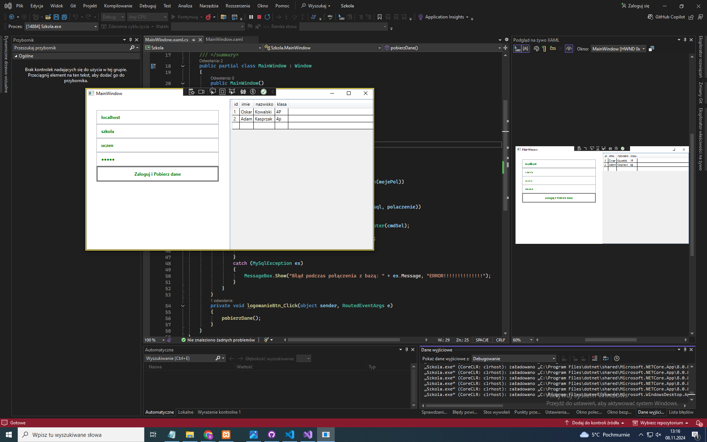

1. Żeby zaimplementować połączenie do bazy danych Mysql musimy najpierw zainstalować pakiety nugget:
    Projekt -> Zarządzaj pakietami NuGet... -> Wpisz "Mysql.Data" i kliknij install
   


2. Tworzymy metodę połączenia
    - Tworzymy stringa do połączenia, w którym definiujemy serwer,bazę danych, użytkownika i hasło np. 

            string mojePol =
                "SERVER=" + nazwaServeratb.Text + ";" +
           
                "DATABASE=" + nazwaBazyDanychtb.Text + ";" +
           
                "UID=" + uzytkowniktb.Text + ";" +
           
                "PASSWORD=" + haslotb.Password + ";";     

    - tworzymy zmienną, w której wybieramy selectem wszystkie dane z bazy
    - robimy using(MySqlConnection polaczenie = new MySqlConnection(mojePol{nazwa stringa do polacznia}))
    - try catch
    - w try robimy using (MySqlCommand  cmdSel = new MySqlCommand(sql{zmienna z selektem}, polaczenie{nazwa z poprzedniego usinga}))
    - Potem w przypadku DataGrid robimy:

      ```csharp
        DataTable dt = new DataTable(); //Definicja tabeli
      
        MySqlDataAdapter da = new MySqlDataAdapter(cmdSel); //Tworzenie adaptera
        
        da.Fill(dt); //Wypełnienie tabeli
      
        dataGrid1.ItemsSource = dt.DefaultView; //Dodanie wypełnionych danych do atrybutu ItemSource naszego DataGrida
        ```
      
    - W catch(jeżeli będzie błąd wyświetlamy komunikat): 
        MessageBox.Show("Błąd podczas połączenia z bazą: " + ex.Message, "ERROR!!!!!!!!!!!!!!"); //ex to metoda catch(MySqlException ex)

        
        
